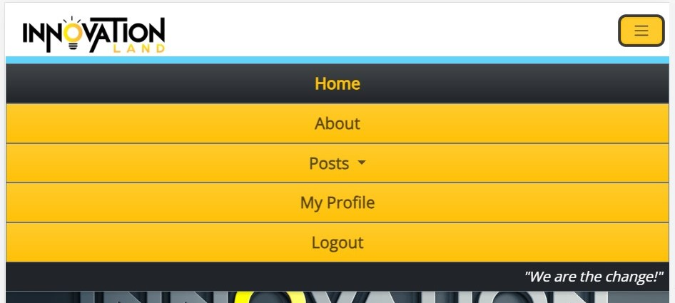

# [Innovation Land](https://innovation-land.herokuapp.com/) 

## Inroduction
Innovation Land is an online marketplace and community where users can create, view, edit, interact and delete public posts. It is created for the purpose of public exposure of various organizations, projects, products and services placed online by innovators and post owners. The purpose of creation any post is to allow user to choose which information is important and relevant to be presented online from large quantity of options. Besides creating posts, users and authors can create visually appealing user profiles with deep customization possibilities like posts. Innovation Land is a website that is part of 7 other websites creating one master solution for the business world to cover needs of other relevant parties such as ideas generators, investors, end-users and more. Each page of this ecosystem is independent with foundations structured to be able to cross-interact with all other 7 websites in the upcoming releases.

## How it works?

- Users are welcomed by landing index page where they can be introduced to the website
- Users can read more on the about page about creators, rules and how does the website work
- Users can register and modify their public profiles
- Users can create, view, edit and delete their own posts
- Users can view public posts and public profiles
- Offers can be placed in the comment section 


## User Stories

- USER STORY 1: "As an innovator, I want to be able to document business-orientened segments for my ideas that I can share with public."
- USER STORY 2: "As a project owner or entrepreneur, I want to share my organization, projects, products and services with the global 
community through direct engangement with visitors and community."
- USER STORY 3: "As an investor, I want to be able to browse catalog of posts and read everything about each post's business proposals"
- USER STORY 4: "As an end-user, I want to know more about the products and services that I am consuming and who provides them to me."
- USER STORY 5: "As a publishing author, I want to write various high-quality posts as a service for organizations, innovators and project owners while being to share as many as possible information about myself for attracting further opportunities."

## Features 

In the first demonstrative version, minimum features and their elements have been disclosed in order to create a rich experience for users over longer periods of time. Also, for legal protection and initial attention from investors, a large amount of information has been summarized to cover main topics and categories before planned full disclosure. Meaning all of our aspects will be expanded shortly, professional media uploaded and final legally protected branding released. We will continue to improve consistently while strategically releasing new content and features according to our planned agenda and the current state of users. This site is made fully responsive across a variety of devices with the lowest guaranteed working width of 320px and height of 640px taking older cellular models into consideration in order to establish full global presence.

## Existing Features:

### Admin Backpage


---

### Alerts


---

### Tab


---

### Navigation Bar

  - The navigation bar is set at the top of the page
  - Navigation bar provides the user with shortcuts for accessing desired sections of the page
  - The navigation bar is intuitive and all types of users can navigate to the desired section without needing any further explanation
  - The main title is page logo that takes the user back to the home page
  - The menu bar to the right of the logo is directing users to the main categories of the page: Home, About, Posts, Profiles, Login/Logout
  - On the larger screens, the menu is shown as full-width, while for tablet and phone sizes of screen, it is collapsed with toggle button  





---

### Footer

  - First part of the footer focuses on the website creators and owners address and contact information
  - The footer section also includes links to the selected few social media sites for Innovation Land.
  - The social media links from icons will open into a new tab to allow easy navigation for the user and to keep our site always open. . 
  - Copyright segment offers direct information on the copyrighted status of the website and the year


---

### Login


---

### Register


---

### Landing Media

  - The landing cover media includes a professional custom-made image
  - This section introduces the user to the Innovation Lamd page with an eye-catching sharp and creative 3D logo
  - This will grab users' attention and increase the chances of a great first impression
  - Without an extensive text introduction requiring serious participation, the image relaxes the user with smooth colors with good contrast bringing users over to the next section that introduces the page.
  - Instead of first reading, then relaxing, we wanted the user to build up the energy instead of dropping it before exploring the rest of the page due to too many textual distractions


---

### Introduction


---

### First Direction


---

### Ecosystem


---

### About Landing Media


---

### About Us


---

### Pricing


---

### Posts Create


---

### Posts List


---

### Posts Details


---

### Posts Details - Page 2


---

### Posts Details - Page 3


---

### Posts Details - Page 4


---

### Posts Details - Page 5


---

### Posts Details - Page 6


---

### Posts Edit


---

### Posts Delete


---

### Profiles


---

### Profiles Edit


---

### Profiles Delete


---

### Additional Features

  - ACCESSIBILITY:
  - Aria-labels on all buttons and interactive elements, more in the next version
  - Keyboard only access tested sucessfully
  - Alt elemenent for images and videos
  - Media queries from small phone to large PC monitors
  - SECURITY:
  - Access to posts and profiles only by registered users for safety
  - Privacy sliders on each building block
  - Password authorization for user accounts
  - 404 page
  - Debug = False
  - Secure data storage
  - No sensitive data in any of project versions and git repostiory
  - Only authors and admins can edit and delete posts and profiles

---

### Upcoming Features

#### Next Version

- Share profile and post
- Public user status of who is authenticated to be online, away, appear offline, actual offline and busy
- Every period different visual landscape for users to match seasons
- Integration with full business ecosystem
- Post templates
- Support chat
- Between users messaging
- Notifications
- Audio/video/image explanations of each post and profile sections
- Searcheable content
- Filtereable content
- Full membership options
- Recommendations
- Friend requests
- Circle requests
- Payment and donation options
- More roles besides admin: community / team / partners / collaborators / moderators
- Translate page button
- Resume (CV) builder with timeline
- Advanced structure of infowall
- Notes and Drafts
- Secure vault posts repository (password)
- Favourite posts and profiles
- Subscribing to all updates of posts and profiles
- Logbook of activities
- Support request form
- Posts rating system
- Blocking users
- Collaboration learning & production environment
- File sharing system for messaging (text, images, audio, videos) (upload/download/save)
- Videos in E-cinema
- Pictures in E-gallery
- Text in E-whiteboard
- Audio in E-speakers
- User / Post Organizer
- User / Post To-do list
- User / Post Schedule
- User verification on location or online
- Weather API
- Social accounts sign-in

## Planning

#### Agile Team

- Manager
- Developer
- Designer
- Tester

#### Agile Development Team Report

In our Agile Development approach, we embraced the principles of Scrum, kanban, flexibility, and continuous improvement. Through iterative development, we broke down our project into manageable user stories, prioritizing and delivering them in short sprints. User involvement was key as we actively seeked and incorporated feedback while conducting regular testing to ensure our features met user needs. With continuous integration and delivery, we seamlessly integrated code changes, run manual tests, and deployed updates to production environments post release during final master testing. Our adaptability shined as we embraced change, refactored code when needed, and maintained a positive innovative mindset throughout. Regular outsider retrospectives allowed us to reflect on our progress, identifying areas for improvement and implementing immediate changes. Transparency and accountability drove us as we tracked progress, every step taken and properly thought about with patience. Documentation was very important, enabling clarity and knowledge sharing through user stories. Finally, we adpoted a culture of continuous learning, encouraging new skillset development and taken extra steps to stay ahead of industry trends. Together, these events guide our Agile Development process, ensuring efficient, collaborative, and high-quality software delivery.

- 12 principles of Agile Software Development followed entire duration of project


---

### [Milestones](https://github.com/bono-94/Full-Stack-Portfolio/milestones) 


---

### [Issues](https://github.com/bono-94/Full-Stack-Portfolio/issues?q=is%3Aissue+is%3Aclosed) 


---

### [Project Board](https://github.com/users/bono-94/projects/2) 


## Design

- Problem Solving:
  - How to solve users problem of not getting enough exposure for their organizations, projects, products and services?
  - How to solve users problem of lack of business knowledge to capture and deliver their ideas to the public marketplace?
  ---

- Empathy and Understanding:
  - Direct connection to the user and their actual real life circumstances
  - Developing a database of potential user personas and if current product would make them happy
  ---

- Definition:
  - Final problem statement, user as center point
  - What is the root or the problem and what is the cure?
  - What needs to be achieved, not how
  ---

- Ideation:
  - Generating key ideas based on well-defined problem
  - Creative solutions to the problem and how it can be achieved
  - Voting and decision and most suitable solution
  ---

- Prototyping:
  - Developed rough draft of the solution
  - Sketches
  - Wireframes
  - Flowchart
  - Data Architecture
  ---

- Testing:
  - Test if final solutions have solved all the problems
  - Testing on real user and real life environment
  - Development of hypothesis and final vision
  ---

- Storytelling:
  - Presenting the findings
  - Presenting the conclusions
  - Presenting the process
  - Presenting the solution
  - Story of users who's challenge was solved
  - Story of Design Thinker, and his next steps
  ---

- User Expectations:
  - Fast service
  - Fast delivery
  - Free/cheap access
  - Contact availability
  - Global accessibility
  - High quality in high quantity
  - Variety of options
  - Flexibility to all user types 
---

- Quantum Coloration:
  - Main colors - orange and black which compliment and contrast each other well (structural coloring purpose)
  - Secondary colors - light blue and white are used as separation between content and main colors (organizational coloring purpose)
  - Tertiary colors - grey which comes out as combination of black and white naturally serves as background and space filler in most of the cases(color-matching purpose)
  - The separation between main and secondary color does a significant purpose to the project visually separating content type for user due to a lot of options and visualisations. They can stand separate or next to each other, 4+1 color model has turned out exactly as envisioned, if not even better. Every element has been colored with purpose and in consideration of all other elements

  

---
- Fonts:
  - Open Sans - used as a balanced, harmonious style for all larger elements of the page
  - Roboto - used as modern, simple and readable style for all paragraph and text elements 
---

- Numerology:
  - Everywhere where possible, number 21 has been encoded, meaning all other additions of it too, 42, 63, 84, etc...
---

- Layout - besides coloring separation, main website structure can be separated on pages below:
  - Index
  - About
  - Register
  - Login
  - Logout
  - Post List Public
  - Post List Private
  - Post Details Page 1
  - Post Details Page 2
  - Post Details Page 3
  - Post Details Page 4
  - Post Details Page 5
  - Post Details Page 6
  - Post Create
  - Post Edit
  - Post Delete
  - Public Profile View
  - Private Profile View
  - Profile Edit
  - Profile Delete
  ---
 
- Media
  - Custom Media - Professional custom work for the most important visual aspect of navigation logo, tab logo and index landing page  
  - Imported Media - Stock images for about page image, profile and post placeholders
  ---

- Design Strategy
  - Focus of this version was deep design and architecture of the back-end
  - There is where the most design has been implemented to ensure strong foundation for the next step
  - In the second version, upon learning React and Rest, focus of design will shift towards the front-end
  - Please note due to hundreds of input fields in Post and Profile models, detailed visualization is not available at the moment
  ---

- Data Design


---

#### User Stories Validation with Design

- USER STORY 1: "As an innovator, I want to be able to document business-orientened segments for my ideas that I can share with public."
    - In the final design of version one user is indeed able to use many options as buildings blocks to build their own small webpage within Innovation Land page
    - This tool is used to offer variety of most-commonly and most important used business questions, documentation and information 
    - User can user privacy sliders to turn off any blocks from showing allowing full self-service online business environment
  ---
- USER STORY 2: "As a project owner or entrepreneur, I want to share my organization, projects, products and services with the global community through direct engangement with visitors and community."
  - In the final design of version one, user can choose what category of a post they would like to post publicly
  - Each post page is structured in a way that for all 4 types user mentioned (organization, projects, products, services) no matter selection it does not impact the rest of the page meaning all blocks are fully flexible and independent of each other
  - User can interact with other users throught comments section on every of 6 post pages at the bottom
  - User also has an option to leave public contact information before comments for further direct and discreet communication
  ---
- USER STORY 3: "As an investor, I want to be able to browse catalog of posts and read everything about each post's business proposals"
  - In the final design of version one, user if registered can view list of all posts created by all users
  - On the page 6 of post details sub-page, user can see any type of proposal that post author or post owner are open to
  - There are basic details for any investor to see how much would it cost them and what do they get in a return
  ---
- USER STORY 4: "As an end-user, I want to know more about the products and services that I am consuming and who provides them to me."
  - In the final design of version one, every registered user can acess posts and see all shared details from authors and owners
  - It contains detailed information about online placement itself, about creators of placement, story of placement and documentation
  - User can also see public proposals the post is offering if they want to futher engage with the creators
  - User has possibility to contact creators directly if that information is publicly shared
  ---
- USER STORY 5: "As a publishing author, I want to write various high-quality posts as a service for organizations, innovators and project owners while being to share as many as possible information about myself for attracting further opportunities."
  - User as a service-provider has large selection of customization tools and different fields to enter their clients content in a professional manner
  - User can create also their profiles with again large selection of options to create their custom profiles to stand out
  - Focus is on business side and as an extension to common Resume (CV) and Cover Letter
  - User has various visuals tools available for use such as privacy sliders, profile photo, profile quote, profile color, profile video, profile background audio, documentation upload, social media buttons, etc...
  - User can leave public contact information in order to capture every potential business interest

## Development

- Create Project 
- Plan Project 
- Start Project 
- Project Settings 
- Create Database 
 - Postgre SQL 
 - Cloudinary
 - Excel 
 - PowerBI 
 - Word
- Create Models 
- Create Views 
- Create Urls 
- Create Forms 
- Create Admin 
- Custom Python Logic 
- Create Templates Structure
- Add Bootstrap 
- Add CSS Custom Styling 
- Add Javascript Interactivity
- Final Test
- Project Results
- Bookmarks & Notes
- Assignment Description
- Deployment
- Full Manual Testing
- Documentation

## Deployment

This project was deployed using Heroku website and ElephantSQL + Cloudinary as a database

### [Live Link](https://innovation-land.herokuapp.com/)

### Deployment steps:
- Create or login to Heroku account
- Activate Student GitHub Pack
- Update billing information
- Create new app/website
  - add name and region
- Access settings
- Create Config Var
  - input “CREDS” into the “KEY” field
  - add “PORT” to “KEY” and “8000” to “VALUE”
- Go to deployment section
  - select github and connect to the relevant account
  - search for relevant repository and connect
  - choose manual deployment option
  - everything gets installed
  - link is provided when finished
- Subscribe to ecodynos plan under the billing options
- Create Coudinary account and wire to django settings
- Create Elephant SQL free account and connect to django environment and Heroku configurations
- Create additional instance on Elephant SQL to separate development from production environment
- Update requierements.txt
- Check if any outstanding migrations
- Turn Debug off
- Add DISABLE_COLLECTSTATIC = 1 in Heroku configuration
- Push changes
- Remove DISABLE_COLLECTSTATIC = 1
- Push changes
- Quick Redeployment
- Quick Testing
- Applying changes where necessary
- Pushing final changes
- Redeployment
- Full manual test
- Populate with content
- Checking if all static files and user uploads are correctly stored in Cloudinary & Elephant SQL

## Testing 

I have conducted infinite hours of testing across all screen sizes, devices and different browsers to conclude that now the site works well and all discussed features are included as intended. Internet Explorer, Google Chrome, Safari, and Firefox on large PC monitors, average laptops, tablets, and various mobile devices all in different screen sizes with minimum width of 320px for older devices. The website was given to friends and family to test out the website representing different types of users and their browsing styles next to personal backgrounds. All content is readable and understandable styled with good contrasting colors that also visually create a good combination. There is no visual bugs or errors after extensive testing

- Automatic testing has been left until version 2.0 when it will be of use for specific new features that will benefit of it
- For current project structure and endless hours of manual testing it does not make significant contribution

### Validator Testing 

- HTML
  - No errors when passing through the official [W3C validator](https://validator.w3.org)
  - All of these files were individually tested, the only warnings it raised is using {{}} and  to render back-end values which is not impacting live version in any way
  - 

---

- CSS
  - No errors when passing through the official [Jigsaw validator](https://jigsaw.w3.org/css-validator)
  - 

---

- Jshint
  -  No errors when passing through the official [Jshint validator](https://jshint.com)
  - Metrics returned:
    - There are 59 functions in this file
    - Function with the largest signature take 1 arguments, while the median is 0
    - Largest function has 32 statements in it, while the median is 8
    - The most complex function has a cyclomatic complexity value of 21 while the median is 2
  - 

---

PEP8
- No errors found when validating all 7 python files and all of their lines of code individually at:
- [Code Institute CI Python Linter](https://pep8ci.herokuapp.com)


----

### Stats

- approximate total lines of code: 14,000
- approximate total templates: 21
- approximate 14,000 words in the project tasklist (Microsoft Word)
- approximate 90 pages of project tasklist (Microsoft Word)


### Manual Testing

This project was manually tested with following procedures:

- Code was passed through a PEP8 linter inside gitpod without any errors returned
- Entire website, every input field, every element and button were tested with correct and incorrect inputs in the both gitpod pre-deployment and Heroku post-deployment environments
- Focus on functionality, usability, responsiveness and data management
- CONCLUSION: Production version matched development version without any errors

---

#### Test 1

- Expected:
  - Nav menu bar is expected to take user to different sections of the page when user presses one of the 4 options
  - Title "Bigger Fish" is expected to take user again to the same page
- Testing: 
  - Tested both features by clicking on them and around them
- Result
  - Both features responded as intended by only directly clicking on them, not around them or empty gray space
---

#### Test 2

- Expected:
  - Nav menu bar is expected to take user to different sections of the page when user presses one of the 4 options
  - Title "Bigger Fish" is expected to take user again to the same page
- Testing: 
  - Tested both features by clicking on them and around them
- Result
  - Both features responded as intended by only directly clicking on them, not around them or empty gray space
----

### Bugs

__Unsolved Bugs__

- All bugs were solved
- There were no significant bugs in the development process
- Mostly it was learning curve of new framework so every step of the code there was an error that was solved with learning, persistance and effort
- Sources of knowledge are included below.
- Once fully understood, everything made sense and it was easy to create entire website without distractions and bugs


## Credits 

### Content, Knowledge and Code
  
- All content and code are 100% unique and custom-made per request for a client in order to prevent any legal issues in the future and to provide full control over an optimized experience

- All content, concepts, and visuals have been exclusively created for this site and to solve specific problem for any user without any external inspiration

- Code structure is also 100% original and completely created by a developer. A developer has followed HTML, CSS, JavaScript and Python courses at [Code Institute](https://codeinstitute.net/global/) where theory on building blocks has been taught. After reading through knowledge materials to see what are possibilities of creating this site are, general blocks have been put together separately to create original work. Given completed examples have not been plagiarized but served as a general guide. Finally, the README structure has been used by Code Institute's template and example in this project in order to be created under industry standards and expectations. A general django template for repository created for students before commencing their project for convenience has been imported before the first coding lines. Project requirements have been used as secondary rough guidelines for the content structure. Consultations with Student Care, Tutors, and Personal Mentor Rowan were provided by them as well which was crucial in this project creation by providing support, motivation, and any mistakes indications and guidance to own problem-solving. Code Institute, therefore can be referenced also as the main knowledge source tool

- All debugging and problem-solving has been done strictly by the developer trying different combinations with known and unknown elements and attributes. No external sources and no professional help just Code Institute's tutors for elaboration on theory and advices dealing with complex problems
 
### Websites & Tools

- [GitHub](https://github.com/) has been used to create project repository, store all the files and create issues, tasks and project board

- [GitPod](https://gitpod.io/) has been used to edit all the project code and files

- [Elephant SQL](https://www.elephantsql.com/ ) has been used for storage and retrieval of all text and numbers data of user inputs

- [Cloudinary](https://cloudinary.com/ ) has been used for storing all users input media and documents, but also local static media used for entire website 

- [Google Chrome](https://www.google.com/chrome/) has been used to capture references as bookmarks, edit code and inspect the pages

- [Draw.io](https://app.diagrams.net/) has been used to visualize database design

- [ChatGPT](https://openai.com/) has been used to write imaginary posts content after deployment for time management to save hours of coming up with the content for posts and profile instead using Lorem ipsum text

- [Grammarly](https://app.grammarly.com/) software has been used to verify grammar on the site and this README file

- [Google Fonts](https://fonts.google.com/) website has been used to import 2 font families: Open Sans & Roboto

- [Coolors](https://coolors.co/fcfcfc-060b0f-ff8600-00a7e1-92a6b5 ) website has been used to create 4+1 color design schema for main colors of the website

- [Font Awesome](https://fontawesome.com/start) website has been used to add all icons on the website

- [Character Counter](https://www.charactercountonline.com/ ) website has been used to count characters for testing the content and fixing python maximum line length

### Libraries

- [Django](https://www.djangoproject.com/) library has been used as a Python framework of the project

- [Summernote](https://summernote.org/getting-started/) library has been used for admin page customization of specific text content

- [Djecrety](https://djecrety.ir/) library has been used to generate random Django secret key 

- [All-auth](https://django-allauth.readthedocs.io/en/latest/) library has been used to create basic registration, login and logout in Django framework

### Templates

- [Code Institute](https://github.com/Code-Institute-Solutions/django-blog-starter-files) template has been used for creating GitHub repository of the project

- [Bootstrap 1](https://getbootstrap.com/docs/5.0/examples/features/) template has been modified and customized for index page list of features

- [Bootstrap 2](https://getbootstrap.com/docs/5.0/examples/jumbotron/) template has been modified and customized for index page jumbotron

- [Bootstrap 3](https://getbootstrap.com/docs/5.0/examples/pricing/) template has been modified and customized for about page memberships 

- [Bootstrap 4](https://getbootstrap.com/docs/5.0/examples/album/) template has been Template modified and customized for structure of post list page (public + private) 

### Documentation & Tutorials

- [Bootstrap](https://getbootstrap.com/docs/5.3/getting-started/introduction/) documentation has been used, specifically large amount of classes for styling of the entire page

- [Code Institute](https://drive.google.com/file/d/156JM9jQThSCTBtePkpUK_Y-tp2X-KNnL/view) documentation has been used to find out how to add env.py file to the Django project securely

- [Django](https://django.readthedocs.io/en/stable/contents.html) documentation has been used to find out all the possibilities of the framework, how to build admin page, how to perform migrations, how to use CSRF token for forms forgery protection, how to use built-in class-based generic views in Django, how to use regular class-based views, how to use generic display and editing views,

- [Django 2](https://docs.djangoproject.com/en/2.2/ref/validators/) documentation has been used to find out how to write custom validators for Django model fields 

- [Geeks for Geeks](https://www.geeksforgeeks.org/class-based-generic-views-django-create-retrieve-update-delete/) documentation has been used to find out how to use class-based generic views in Django (CRUD) 

- [Django 3](https://docs.djangoproject.com/en/3.2/ref/contrib/messages/#using-messages-in-views-and-templates) documentation has been used to find out how to use custom messages Django framework 

- [Geeks for Geeks](https://www.geeksforgeeks.org/filefield-django-models/) documentation has been used to find out hw to specifically use FileField in Django 

- [Geeks for Geeks](https://www.geeksforgeeks.org/imagefield-django-models/) documentation has been used to find out how to specifically use ImageField in Django

- [Django 4](https://docs.djangoproject.com/en/4.2/ref/models/fields/#field-types) documentation has been used to find out how to use field references and attributes in Django model

- [Stack Overflow](https://stackoverflow.com/questions/2472422/django-file-upload-size-limit#:~:text=1048576%20if%20value.-,size%20%3E%20limit%3A%20raise%20ValidationError'File%20too%20large.,should%20not%20exceed%201%20MB) documentation has been used to find out how to apply file size limitations for Django file fields uploads

- [Javatpoint](https://www.javatpoint.com/django-static-files-handling) documentation has been used to find out how to handle Django static files including loading and storing

- [Cloudinary](https://cloudinary.com/documentation/django_image_and_video_upload#django_forms_and_models) documentation has been used to find out how to upload images and video to Cloudinary with Python 

- [PyPI](https://pypi.org/project/django-cloudinary-storage/) documentation has been used to find out how to correctly install Cloudinary storage with Django framework 

- [Merix Studio ](https://www.merixstudio.com/blog/django-crispy-forms-what-are-they-about/) documentation has been used to find out how to use Crispy forms in the back-end and front-end 

- [Django Crispy Forms](https://django-crispy-forms.readthedocs.io/en/latest/crispy_tag_forms.html) documentation has been used to find out how to use Crispy forms in the back-end and front-end 

- [Code Institute](https://docs.google.com/document/d/113P2BPOkrG6rMxsrm8GCbO6CVG2b1R9htD4tRdkSltQ/edit) documentation has been used to find out how to correctly create new Django framework project

- [Code Institute](https://docs.google.com/document/d/1jICeGWmCiIEeJtYMBGFk8pwkCO06kqv6ZkxymijeoAQ/edit) documentation has been used to find out how to return basic HTML template

- [Code Institute](https://docs.google.com/document/d/14emr3aSW96zeFNm0nPqy_u-XKCyYPp7QtDYFylDPJ18/edit) documentation has been used to find out how to migrate and set-up admin page  

- [Code Institute](https://docs.google.com/document/d/12NiYgOfD8QF_eNnOSrERQqLYPqxXRwD_5PGH9yK_Wr0/edit) documentation has been used to find out how to create models

- [Code Institute](https://docs.google.com/document/d/1P5Mzkvzm3HUMrMgABn1KwU_pHnR5n4TUX8rHKB-9CMA/edit) documentation has been used to find out how to render "create new" item page

- [Code Institute](https://docs.google.com/document/d/1RNDHMuQEBJ8if9XYR1WLjNJx_Z4Nad-NarjRVFrC0gQ/edit) documentation has been used to find out how to correctly modify existing data

- [Stack Overflow](https://stackoverflow.com/questions/2491605/how-to-get-the-current-url-name-using-django) documentation has been used to find out how to get current page url name in Django
 
- [W3Schools](https://www.w3schools.com/jsref/met_his_back.asp) documentation has been used to find out how to apply historically previous page on button click

- [GitHub Docs](https://docs.github.com/en/pages/getting-started-with-github-pages/creating-a-custom-404-page-for-your-github-pages-site) documentation has been used to find out how to create custom 404 page
 
### Direct Elements

- [Code Insitute Blog](https://github.com/Code-Institute-Solutions/Django3blog) project has been used as a reference point. The blog post model from here has been adjusted to fit this project's purpose and significantly expanded. Admin, views and URL python files have also been used as a starting point of this project accordingly adjusted, expanded and customized. Template rendering of home page, post list and post details have been used also as inspiration, starting point and foundation, however this has been much more modified to the point that only the code concept has been borrowed after building a lot on top of it. This project would and wouldn’t be possible without Django 3 Blog because it shows the first-time developer what are all required things to take in consideration to build fully functioning app

- [Code Insitute Bootstraping](https://github.com/Code-Institute-Solutions/BootstrappingYourNextBigIdea-BS4/tree/master) project has served the purpose of introducing bootstrap language and how to install it and use it properly. Without the knowledge provided how to use bootstrap, Innovation Land project would be still possible, but it would take significantly more time and resources to achieve the same end result with custom CSS rules.  

- [W3Schools](https://www.w3schools.com/howto/tryit.asp?filename=tryhow_css_image_overlay_opacity) documentation has been used to find out how to add opacity with navigational box on post lists thumbnail images and create buttons view, edit & delete

- [ChatGPT](https://openai.com/) AI code generator has been used to gain first experiences with AI before starting AI university upon completion of this project. Since there was no good source or article to solve my complex problem, I asked AI to write a code for me also to test current advances and to learn how it works. The result is the custom validation code below that it wrote for me for checking validations on 2 input fields that sum of their input must be number 100 to provide users with ratios at strategic place.

  ```
  cleaned_data = super().clean()
        focus_fields = [
            'focus_innovation',
            'focus_financials',
            'focus_planning',
            'focus_monitoring',
            'focus_quality',
            'focus_quantity',
            'focus_collaboration',
            'focus_leadership',
        ]

        total_supply = cleaned_data.get('stocks_quantity_total_supply')
        proposal = cleaned_data.get('stocks_quantity_proposal')
        pos_supply = cleaned_data.get('end_product_or_service_total_supply')
        pos_proposal = cleaned_data.get(
            'end_product_or_service_quantity_proposal'
            )

        focus_values = [cleaned_data.get(field) for field in focus_fields]
        for i in range(0, 8, 2):
            if not all(focus_values[i:i+2]):
                continue
            if sum(focus_values[i:i+2]) != 100:
                msg = f"The sum of {focus_fields[i].split('_', 1)[1]} and " \
                    f"{focus_fields[i+1].split('_', 1)[1]} must be equal " \
                    f"to 100."
                self.add_error(focus_fields[i], msg)
                self.add_error(focus_fields[i+1], msg)

        if total_supply and proposal and proposal > total_supply:
            self.add_error(
                'stocks_quantity_proposal',
                "Quantity proposed can't be higher than the total supply."
                )

        if pos_supply and pos_proposal and pos_proposal > pos_supply:
            self.add_error(
                'end_product_or_service_quantity_proposal',
                "Quantity proposed can't be higher than the total supply."
                )

        return cleaned_data
  ```

### Responsivness Research

- [Worship](https://worship.agency/mobile-screen-sizes-for-2022-based-on-data-from-2021#:~:text=What%20happened%20to%20320px%20wide,as%20a%20'large'%20device) website has been used as research source to find lowest responsivness width that is still in at least minimum global use today

### Media Content

- [Pexels](https://www.pexels.com/photo/grayscale-photo-of-body-of-water-3309865/) - stock image of orca resurfacing on about page

- [Pexels](https://www.pexels.com/photo/top-view-photo-of-people-near-wooden-table-3183150/) - stock image of project team table, humans and devices as placeholder for all posts main image and thumbnail

- [Freepik](https://www.freepik.com/free-vector/low-poly-design-shape-human-head_1125604.htm#page=2&query=avatar%203d%20head&position=12&from_view=search&track=ais) - stock image of placeholder photo for profile and post profiles photo if user did not upload anything 

### Post-deployment Content

- [Zapsplat](https://www.zapsplat.com/) - background sound effects of whales used for post and profile audio background testing

- [Unreal Person](https://www.unrealperson.com/) - random unreal picture of a fake human for uploadeable content as profile and post photo testing upload media

- [Post Image 1](https://www.freepik.com/free-photo/business-corporate-protection-safety-security-concept_3533269.htm#query=cyber%20security&position=10&from_view=search&track=ais)

- [Post Image 2](https://www.freepik.com/free-photo/automatic-transport-robot-transporting-plants-smart-robotic-farmers-concept_21347404.htm#query=vertical%20agriculture&position=12&from_view=search&track=ais)

- [Post Image 3](https://www.freepik.com/free-photo/top-view-assortment-food-with-planner_7371151.htm#query=meal%20plan&position=2&from_view=search&track=ais)

- [Post Image 4](https://www.freepik.com/free-photo/ai-cloud-concept-with-cube_32471123.htm#query=artificial%20intelligence%20blockchain&position=8&from_view=search&track=ais)

- [Post Video](https://www.youtube.com/watch?v=f7Nu3HWnhng)

- [Profile Video](https://www.youtube.com/watch?v=TgDRAqiMP5Q)

---
Thank you for READING ME!