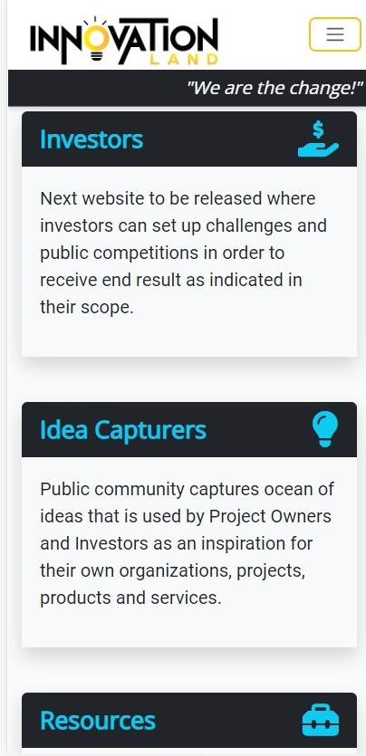

# [Innovation Land](https://innovation-land.herokuapp.com/) 

## Inroduction
Innovation Land is an online marketplace and community where users can create, view, edit, interact and delete public posts. It is created for the purpose of public exposure of various organizations, projects, products and services placed online by innovators and post owners. The purpose of creation any post is to allow user to choose which information is important and relevant to be presented online from large quantity of options. Besides creating posts, users and authors can create visually appealing user profiles with deep customization possibilities like posts. Innovation Land is a website that is part of 7 other websites creating one master solution for the business world to cover needs of other relevant parties such as ideas generators, investors, end-users and more. Each page of this ecosystem is independent with foundations structured to be able to cross-interact with all other 7 websites in the upcoming releases.

## How it works?

- Users are welcomed by landing index page where they can be introduced to the website
- Users can read more on the about page about creators, rules and how does the website work
- Users can register and modify their public profiles
- Users can create, view, edit and delete their own posts
- Users can view public posts and public profiles
- Offers can be placed in the comment section 

## User Stories

- As an innovator, I want to be able to expand my vision with endless possibilities in online business plan creator
- As a project owner, I want to share my organization, projects, products and services with the global community
- As an investor, I want to be able to engage with and read all about each post's business proposals
- As an end-user, I want to know more about the products and services that I am consuming and potentially participate further
- As a post author, I want to write various high-quality posts as a service for innovators and project owners

## Features 

In the first demonstrative version, minimum features and their elements have been disclosed in order to create a rich experience for users over longer periods of time. Also, for legal protection and initial attention from investors, a large amount of information has been summarized to cover main topics and categories before planned full disclosure. Meaning all of our aspects will be expanded shortly, professional media uploaded and final legally protected branding released. We will continue to improve consistently while strategically releasing new content and features according to our planned agenda and the current state of users. This site is made fully responsive across a variety of devices with the lowest guaranteed working width of 320px and height of 640px taking older cellular models into consideration in order to establish full global presence.

---

### Existing Features

__Admin__

---

__Alerts__

---

__Tab__

---

__Navigation Bar__

  - The navigation bar is set at the top of the page
  - Navigation bar provides the user with shortcuts for accessing desired sections of the page
  - The navigation bar is intuitive and all types of users can navigate to the desired section without needing any further explanation
  - The main title is page logo that takes the user back to the home page
  - The menu bar to the right of the logo is directing users to the main categories of the page: Home, About, Posts, Profiles, Login/Logout
  - On the larger screens, the menu is shown as full-width, while for tablet and phone sizes of screen, it is collapsed with toggle button  

---

__Footer__

  - First part of the footer focuses on the website creators and owners address and contact information
  - The footer section also includes links to the selected few social media sites for Innovation Land.
  - The social media links from icons will open into a new tab to allow easy navigation for the user and to keep our site always open. . 
  - Copyright segment offers direct information on the copyrighted status of the website and the year

---

__Login__

---

__Register__

---

__Landing Media__

 - The landing cover media includes a professional custom-made image
  - This section introduces the user to the Innovation Lamd page with an eye-catching sharp and creative 3D logo
  - This will grab users' attention and increase the chances of a great first impression
  - Without an extensive text introduction requiring serious participation, the image relaxes the user with smooth colors with good contrast bringing users over to the next section that introduces the page.
  - Instead of first reading, then relaxing, we wanted the user to build up the energy instead of dropping it before exploring the rest of the page due to too many textual distractions

---

__Introduction__

---

__First Direction__

---

__Ecosystem__

---

__About Landing Media__

---

__About Us__

---

__Pricing__

---

__Posts Create__

---

__Posts List__

---

__Posts Details__

---

__Posts Details - Page 2__

---

__Posts Details - Page 3__

---

__Posts Details - Page 4__

---

__Posts Details - Page 5__

---

__Posts Details - Page 6__

---

__Posts Edit__

---

__Posts Delete__

---

__Profiles__

---

__Profiles Edit__

---

__Profiles Delete__

---

### Upcoming Features

__Next Version__

- Share profile and post
- Public user status of who is authenticated to be online, away, appear offline, actual offline and busy
- Every period different visual landscape for users to match seasons
- Integration with full business ecosystem
- Post templates
- Support chat
- Between users messaging
- Notifications
- Audio/video/image explanations of each post and profile sections
- Searcheable content
- Filtereable content
- Full membership options
- Recommendations
- Friend requests
- Circle requests
- Payment and donation options
- More roles besides admin: community / team / partners / collaborators / moderators
- Translate page button
- Resume (CV) builder with timeline
- Advanced structure of infowall
- Notes and Drafts
- Secure vault posts repository (password)
- Favourite posts and profiles
- Subscribing to all updates of posts and profiles
- Logbook of activities
- Support request form
- Posts rating system
- Blocking users
- Collaboration learning & production environment
- File sharing system for messaging (text, images, audio, videos) (upload/download/save)
- Videos in E-cinema
- Pictures in E-gallery
- Text in E-whiteboard
- Audio in E-speakers
- User / Post Organizer
- User / Post To-do list
- User / Post Schedule
- User verification on location or online
- Weather API
- Social accounts sign-in

## Design

- Colors:
  - Main colors - coral, green, light skyblue and dark gray which compliment and contrast each other (structural coloring purpose)
  - Secondary colors - black, light gray, brown are used as separators between main content and main colors (organizational coloring purpose)
  - Tertiary colors - yellow, red, purple, pink, dark blue are used for game board buttons to represent each ocean animal (color-matching purpose)
- Fonts:
  - Oswald - used as fisherman-like font for main important to read information such as title, pages, footer, rules and similar
  - Titan One - used as bubbly retro contrast to Oswald which is used for all in-game text to change the mode of user from reading to entertaintainment mood
- Layout - besides coloring separation, main page structure can be separated on Website Mode and Game Mode
  - Website Mode - main landing page where user can take their time and explore rules, fill up forms, and follow social media links
  - Game Mode - once user starts the game with inserting a coin, structure is not anymore one long solid html page
    - instead, different smaller sections written in html are constantly exchanging with each other with use of Javascript
    - snappy screen width and height to the users' devices without scrolling to get the feeling of using a gaming app instead a long website page
- Media
  - Custom Media - Professional custom work for the most important visual aspect of game logo, intro video and loading video  
  - Imported Media - Stock images that can fill up mostly backgrounds and the relevant image for the Results Screens

## Testing 

I have conducted enough hours of testing across all screen sizes, devices and different browsers to conclude that now the site works well and all discussed features are included as intended. Internet Explorer, Google Chrome, Safari, and Firefox on large PC monitors, average laptops, tablets, and various mobile devices all in different screen sizes with minimum width of 320px for older devices. The website was given to friends and family to test out the website representing different types of users and their browsing styles next to personal backgrounds. All content is readable and understandable styled with good contrasting colors that also visually create a good combination. There is no visual bugs or errors after extensive testing

### Validator Testing 

- HTML
  - No errors when passing through the official [W3C validator](https://validator.w3.org)
  - 

- CSS
  - No errors when passing through the official [Jigsaw validator](https://jigsaw.w3.org/css-validator)
  - 

- Jshint
  -  No errors when passing through the official [Jshint validator](https://jshint.com)
  - Metrics returned:
    - There are 68 functions in this file
    - Function with the largest signature take 0 arguments, while the median is 0
    - Largest function has 16 statements in it, while the median is 4
    - The most complex function has a cyclomatic complexity value of 13 while the median is 1
  - 

- Accessibility
  - This test confirms that the colors and fonts chosen are easy to read and accessible to users. All scores are satisfactory besides performance since the site uses complex visuals and animation and large media which will be solved with the next update. The only issue found by the Lighthouse is referring to picture sizes, which are not impacting any animation or positioning of additional elements. It causes more taxation on the computing system and increases loading time, but the final results are as coded across all screens. All common practices and SEO levels have passed with a full percentage
  - talk about alt and aria-labels

    

PEP8
- No errors found when validating all 519 lines of code from:
- [Code Institute CI Python Linter](https://pep8ci.herokuapp.com)

----

### Manual Testing

This project was manually tested with following procedures:

- Code was passed through a PEP8 linter inside gitpod without any errors returned
- Program was tested with correct and incorrect inputs in the both gitpod and Heroku terminals

---

#### Nav Menu Bar

- Expected:
  - Nav menu bar is expected to take user to different sections of the page when user presses one of the 4 options
  - Title "Bigger Fish" is expected to take user again to the same page
- Testing: 
  - Tested both features by clicking on them and around them
- Result
  - Both features responded as intended by only directly clicking on them, not around them or empty gray space

#### Email Field - Feeback Form

- Expected:
  - Nav menu bar is expected to take user to different sections of the page when user presses one of the 4 options
  - Title "Bigger Fish" is expected to take user again to the same page
- Testing: 
  - Tested both features by clicking on them and around them
- Result
  - Both features responded as intended by only directly clicking on them, not around them or empty gray space

----

#### User Stories Validation

- USER STORY 1: As a crypto investor, I want to engage into Play-to-Earn gaming so that I can multiply my investment
  - The completed game has not only set up the entertainment gaming aspect but a solid foundation to introduce play-to-earn mechanism in the version 2. For now investors can play demo version and get familiar how it works
- USER STORY 2: As a young gamer, I want to play games online with friendly characters so that I can enjoy visual aspects
  - By introducing Sharky, the character from the logo, younger audience is more open to enter the entertaining game with characters that they can relate to and get introduced to financial world
- USER STORY 3: As an older gamer, I want to play strategic game so that I can keep engaging and developing my brain
  - During the gameplay, there is endless combinations of betting amounts to achieve the victory, user can explore and test various strategies in order to force the opponent's loss, a lot of thinking can be used to gain competitive advantage while keeping brain neural links active
- USER STORY 4: As an innovator, I want to play inspirative new game concepts so that I can create my own similar game
  - Since a completely new and original gaming concept is introduced in the game, innovators can take this concept and create their own twist of the game, such as monopoly and UNO can be played various different ways but core concept remains the same
- USER STORY 5: As unemployed citizen, I want to play time consuming financial games so that I can think about money more ofter
  - For people with a lot of time on their hands, this game can be played on a loop with endless balances and outcomes. Those people are pushed to understand more value of money in the world and how much it is necessary to survive

----

### Bugs

__Unsolved Bugs__

- All bugs were solved
- There was not any significant bugs in the development process
- Mostly it was learning curve of new framework
- Once fully understood, everything made sense and it was easy to create entire website without distractions

--- 

## Deployment

This project was deployed using Code Institute's mock terminal for Heroku website.

### Deployment steps:
- Update requierements.txt
- Create or login to Heroku account
- Activate Student GitHub Pack
- Update billing information
- Create new app/website
    - add name and region
- Access settings
- Create Config Var
    - input “CREDS” into the “KEY” field
    - copy creds.json file contents and paste into “VALUE” field
    - add “PORT” to “KEY” and “8000” to “VALUE”
- Add Buildpack
    - add python to the top of the list
    - add nodejs to the bottom of the list
- Go to deployment section
    - select github and connect to the relevant account
    - search for relevant repository and connect
    - choose manual deployment option
    - everything gets installed
    - link is provided when finished
- Subscribe to ecodynos plan under the billing options
- Create README file
- Push changes
- Quick Redeployment

### [Run program](https://life-tracker.herokuapp.com/)
### [Access results sheet](https://bit.ly/life-tracker-sheet)
----

## Credits 

### Content, Knowledge and Code
  
- All content and code are 100% unique and custom-made per request for a client in order to prevent any legal issues in the future and to provide full control over an optimized experience

- All content, concepts, and visuals have been exclusively created for this site and to solve specific problem for any user without any external inspiration

- Code structure is also 100% original and completely created by a developer. A developer has followed HTML, CSS, JavaScript and Python courses at [Code Institute](https://codeinstitute.net/global/) where theory on building blocks has been taught. After reading through knowledge materials to see what are possibilities of creating this site are, general blocks have been put together separately to create original work. Given completed examples have not been plagiarized but served as a general guide from a client for a developer from project examles such as: love-sandwiches and battleships. Finally, the README structure has been used by Code Institute's template and example in this project in order to be created under industry standards and expectations. A general python template for repository created for students before commencing their project for convenience has been imported before the first coding lines. Project requirements have been used as secondary rough guidelines for the content structure. Consultations with Student Care, Tutors, and Personal Mentor Rowan were provided by them as well which was crucial in this project creation by providing support, motivation, and any mistakes indications and guidance to own problem-solving

- All debugging and problem-solving has been done strictly by the developer trying different combinations with known and unknown elements and attributes. No external sources and no professional help just Code Institute's tutors for elaboration on theory and advices dealing with complex problems
 
  - [W3schools](https://www.w3schools.com/) has been used as an additional knowledge course. Reading over the second set and point of view on theory and understanding of elements to seal the Code Institue knowledge and review before writing the project for a full rough draft of the idea

  - [Codepad](https://codepad.co/snippet/button-with-sound-effect) has been used to give Java instructions on how to play sound at a specific place in functions and how to do it. Code was not used directly but as a learning method to understand new concepts. 

        $(document).ready(function() {
    
          var audio  = new Audio('https://s3-us-west-2.amazonaws.com/s.cdpn.io/242518/click.mp3');
          var audio2 = new Audio('https://s3-us-west-2.amazonaws.com/s.cdpn.io/242518/clickUp.mp3')

          $(".button").mousedown(function() {
            audio2.load();
            audio2.play();
          });
          
          $(".button").mouseup(function() {
            audio.load();
            audio.play();
          });
        });

- [FreeCodeCamp](https://www.freecodecamp.org/news/refresh-the-page-in-javascript-js-reload-window-tutorial/) has been used to learn more about another unknown concept in JavaScript which helped the project to switch from Gaming Mode back to the index Website Mode

      window.location.reload();

- [W3Schools](https://www.w3schools.com/js/js_random.asp) has been used to build on the Math.random knowledge from Code Institute by adding minimum and maximum values to each randomly generated numbers

      Math.floor(Math.random() * 100) + 1;

- [Draft.dev](https://draft.dev/learn/github-pages-404) has been used to build custom 404 error page when user tries to access non-existing pages

### Media

  - Every photo and both videos featuring coins or logos are all original works created especially for this site

  - The background photos on all pages that represent nature have been all downloaded from only 2 external sources:
  
    - [Pexels](https://www.pexels.com/)

    - [Unsplash](https://unsplash.com/)

 - The photos used in this README file to demonstrate responsiveness are made on the website:
  
    - [Am I Responsive?](https://ui.dev/amiresponsive)

  - Both external fonts have been imported from:
  
    - [Google Fonts](https://fonts.google.com/)
  
  - All external icons have been imported from:
  
    - [Font Awesome](https://fontawesome.com/)

  - All external audios have been imported from:

    - [ZapSplat](https://www.zapsplat.com/)

### Tools

- [Grammarly](https://app.grammarly.com/) software has been used to verify grammar on the site and this README file

- [Formsubmit](https://formsubmit.co/) website has been used to mail form results to the developer's email address

- [Responsive Design Checker](https://responsivedesignchecker.com/) website has been used to test various screen sizes and website responsiveness for popular devices

### Media
  
- [Am I Responsive?](https://ui.dev/amiresponsive) - The photo from the website was used in this README file to demonstrate responsiveness

---

### Tools

- [Grammarly](https://app.grammarly.com/) - software has been used to verify grammar on the site and this README file

- [Zapier](https://zapier.com/) - online automation website that is used to send emails every time new user enters a new imput

- [Draw.io](https://app.diagrams.net/) - online website that was used to create Flowchart for README

---
Thank you for READING ME!